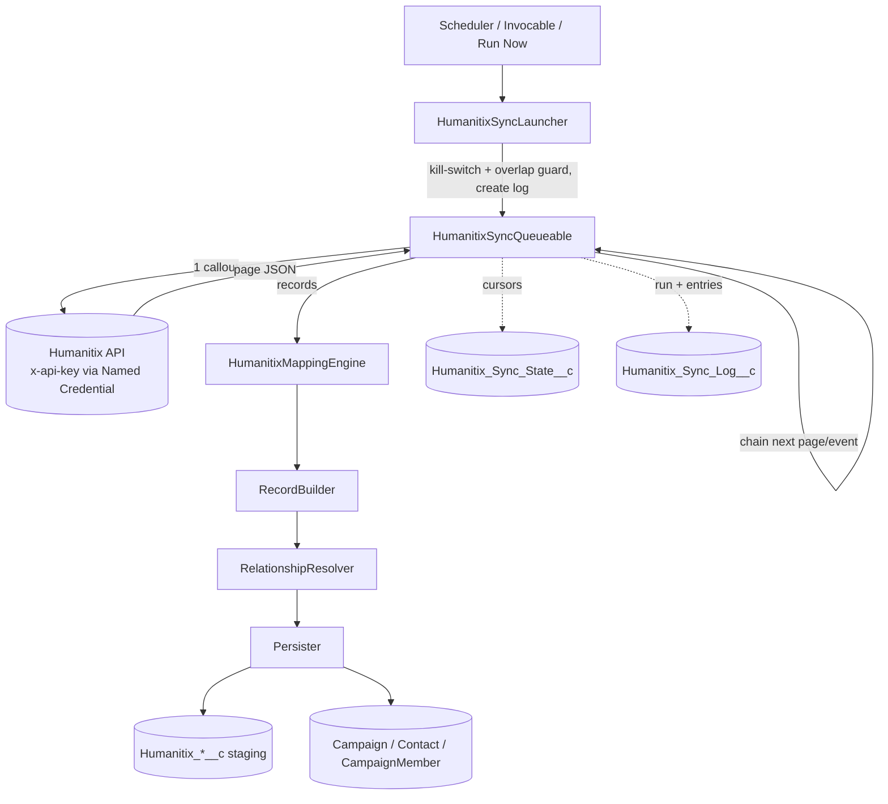

# Architecture

A read-only, pull-based connector. A scheduled/on-demand **sync engine**
authenticates through a Named/External Credential, pages the Humanitix REST API
through a chain of Queueables with incremental `since` cursors, and hands each page
to a **Custom-Metadata-driven mapping engine** that writes both a faithful
custom-object layer and standard CRM objects.

## Components

- **Custom objects (system of record):** `Humanitix_Event__c`,
  `Humanitix_Ticket_Type__c`, `Humanitix_Event_Date__c`, `Humanitix_Order__c`,
  `Humanitix_Ticket__c`, `Humanitix_Order_Attribute__c`,
  `Humanitix_Ticket_Attribute__c`, `Humanitix_Tag__c`.
- **Operational objects:** `Humanitix_Sync_Log__c` + `Humanitix_Sync_Log_Entry__c`
  (observability), `Humanitix_Sync_State__c` (cursors).
- **Standard-object fields:** external-id + data fields added to Campaign, Contact,
  CampaignMember (and optional Lead/Account).
- **Config:** `Humanitix_Object_Mapping__mdt` + `Humanitix_Field_Mapping__mdt`
  (mapping), `Humanitix_Sync_Setting__mdt` (paging/scope/retries), and the
  `Humanitix_Sync_Toggle__c` custom setting (kill switch).
- **Auth:** `HumanitixAPI` External Credential (Custom protocol, encrypted `ApiKey`)
  + Named Credential injecting the `x-api-key` header.
- **Apex:** HTTP (`HumanitixHttpClient`, `HumanitixApiResponse`,
  `HumanitixRetryPolicy`); mapping (`HumanitixMappingEngine`, `…Config`,
  `…JsonNavigator`, `…TypeCoercer`, `…RecordBuilder`, `…RelationshipResolver`,
  `…Persister`); sync (`HumanitixSyncQueueable`, `…State`, `…StateService`,
  `…LogService`, `…Config`, `…Launcher`, `…Scheduler`, `…Invocable`,
  `…AdminController`).

## Sync flow

Phases run in canonical order **Tags → Events → Orders → Tickets** (only the
enabled ones). Orders/Tickets keyset-iterate non-archived events. Each Queueable
execution:

1. Does exactly **one callout** (one page).
2. Classifies the response. On 429/5xx it **re-enqueues with a whole-minute delay**
   (Queueables can't sleep); on other 4xx it logs a failed entry and advances to the
   next work item (**fault isolation** — one bad event never aborts the run).
3. On success, hands the page to the mapping engine (**one DML pass**), logs an
   entry, and either advances the page or **promotes the cursor** and moves on.
4. Chains the next execution, carrying a small serializable state.

This one-callout-then-one-DML-per-transaction shape respects the platform rule that
a callout can't follow uncommitted DML, and keeps every step well inside governor
limits regardless of dataset size.

## Correctness decisions

- **Contact identity = normalized email.** Buyer and attendee resolve to the same
  Contact; Humanitix ids are stored as non-unique reference fields. Attendees with
  no email can't be de-duplicated and live on `Humanitix_Ticket__c` (documented
  limitation).
- **Campaign Member at Contact+Campaign grain** (`MatchByFields` on
  `CampaignId,ContactId`) — respects the platform's native unique key. Per-ticket
  detail is on `Humanitix_Ticket__c`, not forced into members.
- **Timezone-correct dates.** `IsoToDateInTz` converts the UTC instant to the
  event's timezone before truncating to a `Date`, avoiding an off-by-one.
- **Idempotency.** All writes are external-id upserts (or field-matched
  insert/update); in-page duplicate keys are collapsed before DML. Re-running is
  safe; cursors advance only on success.
- **Incremental watermark = run start.** Promoted only when a resource/event
  completes, so a record changed mid-run is re-fetched next run, never skipped.
- **Security.** All Apex is `with sharing`; writes go through
  `Security.stripInaccessible`; the API key lives only in the External Credential.

## Extending

- Add a resource or object → add Object/Field Mapping records (see
  [FIELD-MAPPING.md](FIELD-MAPPING.md)).
- Add a transform → extend `HumanitixTypeCoercer` and the `Transform__c` picklist.
- Add a custom object/field → edit `scripts/dev/generate-metadata.py` and re-run so
  permission-set FLS stays in sync.

## Roadmap / not in v1

Opportunity/revenue mapping, multi-region credentials, and a periodic
full-reconciliation sweep for hard deletes are intentionally deferred (see the
project spec). Lead/Account mappings ship inactive and are one toggle away.
